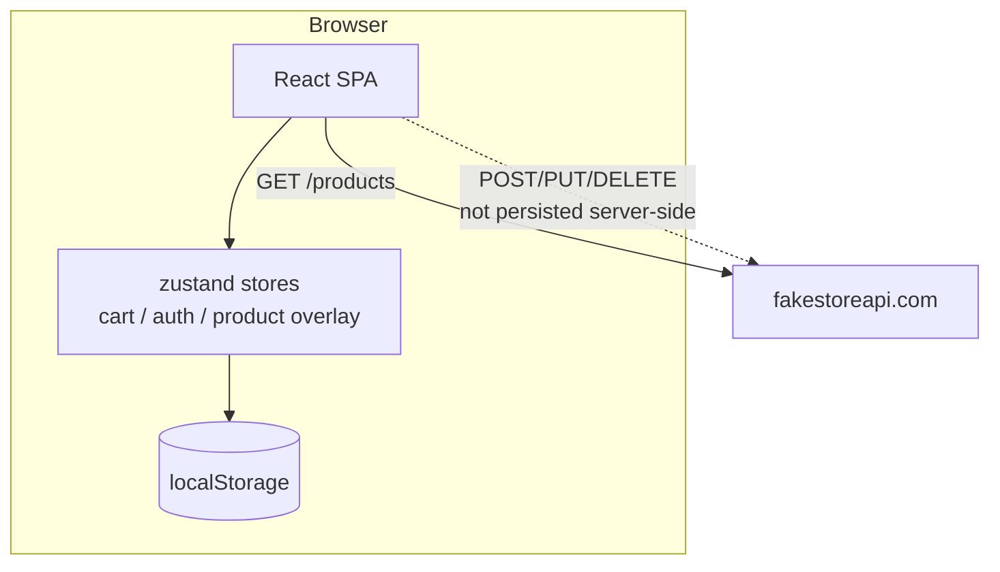

# Architecture overview

**Last updated:** 2026-09-25

ShopEasy is a client-only React SPA. There is no backend of our own — product data comes from the
public [Fake Store API](https://fakestoreapi.com/products), which is read-only in practice. All
mutable state (cart, admin session, admin product changes) lives in the browser via zustand +
localStorage. This document is the entry point: it ties together the per-feature docs in
[`features/`](./README.md).

## Stack

| Concern    | Choice                                                  |
| ---------- | ------------------------------------------------------- |
| Build      | Vite 8                                                  |
| UI         | React 19 + TypeScript ~6.0 (strict)                     |
| Styling    | Tailwind CSS v4 (`@tailwindcss/vite`), `tw-animate-css` |
| Components | shadcn/ui (radix base) in `src/components/ui/`          |
| Routing    | react-router-dom v7 (`BrowserRouter`)                   |
| State      | zustand v5 with `persist`                               |
| Icons      | lucide-react                                            |
| Toasts     | sonner (`Toaster` mounted in `App.tsx`)                 |
| Lint       | ESLint 10 + typescript-eslint                           |

Exact resolved versions, config files, and scripts: [Tech stack & tooling](./tech-stack.md).

## System context



Two facts drive most of the design:

1. **The API is read-only in practice.** Writes return plausible responses but never save, so admin
   changes are recorded in a local overlay and merged over fresh API data.
2. **There is no auth server.** Admin auth is a hardcoded client-side mock, not a security boundary.

Both are deliberate, documented decisions — see `AGENTS.md`.

## Data flow (products)

This is the central mechanism of the app; the storefront and admin panel both depend on it.

```
fakestoreapi GET /products
        │
        ▼
  fetchProducts()                 src/api/products.ts
        │
        ▼
  useProducts()                   src/hooks/useProducts.ts   ← the single read path
        │  ├─ subscribes to overlay store
        │  └─ mergeProducts(base, overlay)
        ▼
  merged Product[]  +  derived categories
        │
        ├──▶ HomePage / ProductDetailPage / ProductCard      (storefront reads)
        └──▶ AdminProductsPage / AdminProductFormPage        (admin reads)

admin add / edit / delete
        │
        ├─▶ API write call (realistic, non-persisting)       src/api/products.ts
        └─▶ useProductOverlayStore  ──▶ localStorage          src/store/productOverlayStore.ts
```

`mergeProducts` (`src/lib/products.ts`) applies, in order: **filter deleted → apply edits → prepend
added**. Because `useProducts` subscribes to the overlay store, an admin change re-renders the
storefront in the same browser with no refetch.

Full detail: [Product overlay](./features/product-overlay.md).

## State stores

| Store           | File                               | localStorage key          | Persists                          | Purpose                                     |
| --------------- | ---------------------------------- | ------------------------- | --------------------------------- | ------------------------------------------- |
| Cart            | `src/store/cartStore.ts`           | `cart-storage`            | `items`                           | Shopper's selected products + quantities    |
| Auth            | `src/store/authStore.ts`           | `admin-auth-storage`      | `isAuthenticated`                 | Mock admin session flag                     |
| Product overlay | `src/store/productOverlayStore.ts` | `product-overlay-storage` | `added` / `edited` / `deletedIds` | Admin product changes layered over API data |

Conventions: one store per concern, `create<T>()(persist(...))`, all in `src/store/`. Components read
narrow slices (`useCartStore((s) => s.items)`) rather than the whole store. Clearing a key resets that
concern; there is no reset UI.

## Folder layout

```
src/
  api/         fakestoreapi client (fetch + non-persisting create/update/delete)
  store/       zustand stores: cart, admin auth, product overlay
  hooks/       useProducts — the single read path for product data
  lib/         mergeProducts, cart math, formatPrice, cn
  components/
    layout/    StorefrontLayout/Header/Footer, AdminLayout
    products/  ProductCard, ProductGrid
    admin/     DeleteProductDialog
    ui/        shadcn/ui primitives (do not hand-roll these)
  pages/
    storefront/  Home, ProductDetail, Cart, Checkout, OrderConfirmation, NotFound
    admin/       AdminLogin, AdminProducts, AdminProductForm
  routes/      AppRoutes (route table), RequireAdminAuth (guard)
  types/       Product, CartItem, Order
```

## Routing

Two layout trees plus a 404, all declared in one table. Storefront is public; the admin subtree is
wrapped in `RequireAdminAuth`. `/admin/login` deliberately sits **outside** the guarded tree.

Full route table: [Routing & layouts](./features/routing-and-layouts.md).

## Feature map

| Feature            | Doc                                                         | Summary                                             |
| ------------------ | ----------------------------------------------------------- | --------------------------------------------------- |
| Storefront         | [storefront.md](./features/storefront.md)                   | Browse, search, filter, product detail, add to cart |
| Product overlay    | [product-overlay.md](./features/product-overlay.md)         | Local persistence that makes admin writes stick     |
| Admin auth         | [admin-auth.md](./features/admin-auth.md)                   | Mock client-side login + route guard                |
| Admin product CRUD | [admin-product-crud.md](./features/admin-product-crud.md)   | Admin table, form, delete dialog                    |
| Shopping cart      | [shopping-cart.md](./features/shopping-cart.md)             | Cart store, badge, cart page                        |
| Guest checkout     | [guest-checkout.md](./features/guest-checkout.md)           | Order summary → confirmation, no payment            |
| Routing & layouts  | [routing-and-layouts.md](./features/routing-and-layouts.md) | Full route table, layouts, guards                   |

## Cross-cutting conventions

- **Path alias** — `@/*` → `src/*`. No `baseUrl` in tsconfig (deprecated in this TS version); `paths`
  alone works with `moduleResolution: "bundler"`.
- **Type-only imports** — `verbatimModuleSyntax: true` requires `import type { Foo }` for types.
- **Unused locals** — `noUnusedLocals`/`noUnusedParameters` are on; don't destructure-and-discard a
  key. Copy the object and `delete obj.key` instead.
- **UI primitives** — always use shadcn/ui components from `src/components/ui/` rather than
  hand-rolled markup for buttons, dialogs, inputs, tables, etc.
- **Toasts** — call `toast.success(...)` / `toast.error(...)` from `sonner`; the `Toaster` is already
  mounted in `App.tsx`.
- **Money** — always format via `formatPrice` (`src/lib/format.ts`), never string-concatenate `$`.
- **Product data** — read only through `useProducts`; never call `src/api/products.ts` from a page or
  component for reads.

## Commands

| Command           | Purpose                                        |
| ----------------- | ---------------------------------------------- |
| `npm run dev`     | Vite dev server                                |
| `npm run build`   | `tsc -b && vite build` (type-check then build) |
| `npm run lint`    | ESLint over the repo                           |
| `npm run preview` | Preview a production build                     |

Run `npm run build` (or at least `npm run lint`) after non-trivial changes.

## Constraints / non-goals

Deliberate, per `AGENTS.md` — don't "fix" these without being asked:

- No real backend, database, or payment integration.
- No real authentication or security boundary.
- No automated tests or CI (none exist by design).
- No server-side rendering, data-caching layer, or route code splitting.

## Environment files

The repo has `.env.example`, `.env.dev`, `.env.stage`, `.env.prod`, and `.env.test`.

- **Only `.env.example` may be read, opened, or edited.**
- **Never access `.env.dev`, `.env.stage`, `.env.prod`, or `.env.test`** — they may contain real
  secrets. If a task seems to need their contents, stop and ask.

See `AGENTS.md` for the full policy.

## Documentation map

- [`docs/README.md`](./README.md) — feature doc index + the template for new feature docs.
- [`docs/tech-stack.md`](./tech-stack.md) — exact versions, tooling, and config.
- [`docs/features/`](./features/) — one doc per feature.
- `AGENTS.md` — agent instructions, conventions, and the environment-file policy.
